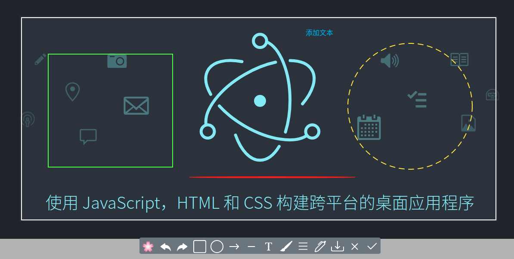
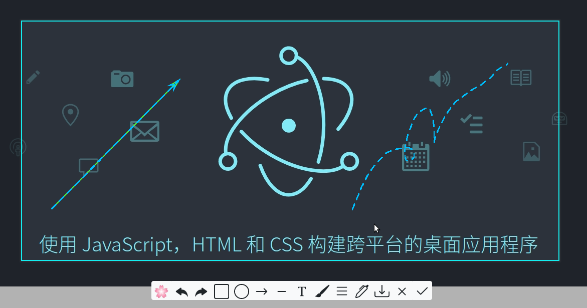
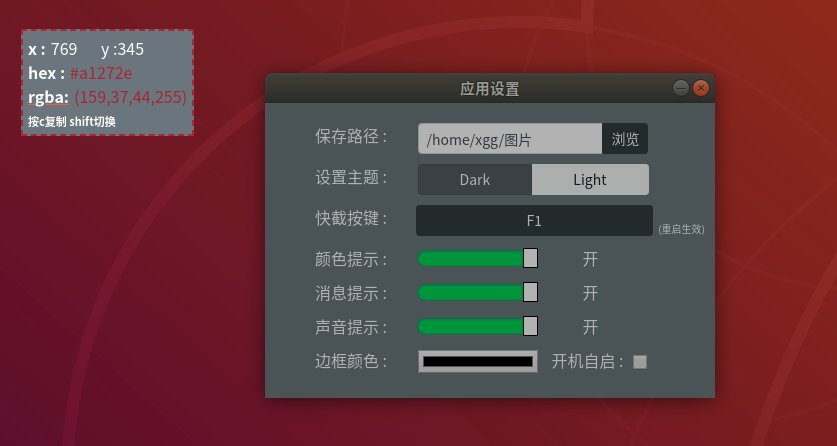

# orchid

This is a cross-platform screenshot tool based on vue and electron.

# features

This tool contains features as bellow:

1. desktop colorpicker. Press `shift` to switch between color `rgba` and `hex`,then press `c` can copy the color to clipboard.
2. desktop capture.You can drag the capture region,draw square,circle,arrow,line and input text. You can also change the settings on context menu,including theme(dark and light),path,shortcut and more.

# install

If you want to have a try, you can download setup packages on the release page.

